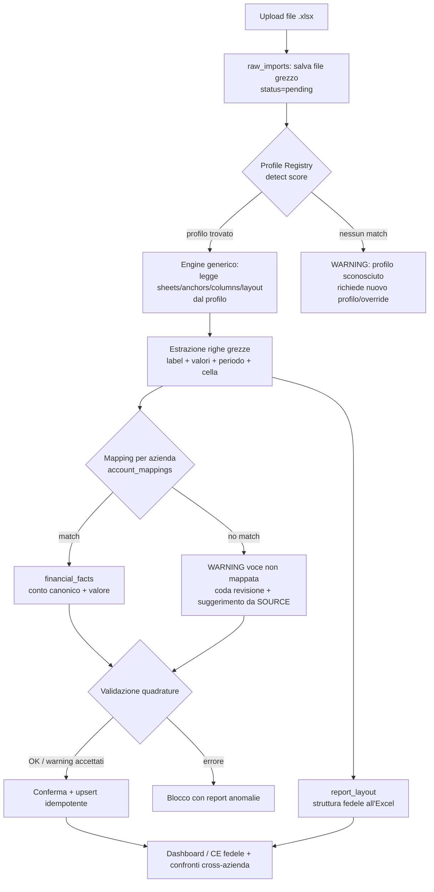

# Ingestione eterogenea di bilanci Excel — Analisi e impostazione sistemica

> Documento di **design** (non implementazione). Obiettivo: definire un'architettura che permetta alla
> piattaforma di leggere in futuro **molti file Excel di bilancio con schemi e strutture diversi**,
> mostrando al cliente **fedelmente ciò che c'è nell'Excel** ma in una piattaforma dedicata, senza
> dover modificare il codice applicativo per ogni nuova azienda/template.
>
> Base empirica: analisi reale di due bilanci 2025 strutturalmente diversi
> (`Awentia` e `SHERPA42`) tramite script usa-e-getta in `scripts/_analysis/`
> (dump in `tmp/awentia_dump.txt` e `tmp/sherpa_dump.txt`).

---

## 1. Analisi strutturale comparata dei due file

### 1.1 Awentia — `[2025] Analisi Bilanci Awentia v. 2.xlsx`

**29 fogli.** Tre famiglie funzionali:

| Famiglia | Fogli | Scopo |
|---|---|---|
| Partitari mensili (saldi YTD) | `gen24`…`dic24`, `gen25`…`dic25` (24 fogli) | Saldo **progressivo** per conto contabile, un foglio per mese×anno |
| Pivot/mapping interno | `Source` | Tabella conto → `Famiglia` / `Analitica` + valori mensili progressivi |
| Conto Economico riclassificato | `1_CE dettaglio`, `CE dettaglio mensile`, `3_CE sintetico`, `4_CE sintetico mensile` | CE gestionale per voce, in versione progressiva annuale e in griglia mensile |

**Partitari mensili** (es. `dic25`): 3 colonne fisse `Conto1 | Descrizione1 | Saldo1`. Codice conto
gerarchico `66/25/006`. Il `Saldo` è **cumulato YTD** (es. conto merci: gen 185 → feb 19.723 → mar 20.173…).
Alcuni mesi includono righe di chiusura (`TOTALE COSTI`, `TOTALE RICAVI`, `PERDITA DI ESERCIZIO`,
`TOTALE A PAREGGIO`). Ricavi memorizzati con **segno negativo**.

**Foglio `Source`** — è il **motore di mapping già presente nell'Excel**:
- Riga 0: `Mese | 12 | Anno | 2025 | … | ANNO CORRENTE`
- Riga 1: numeri mese `1..12` a partire da `C5`
- Riga 2 (header reale): `Conto Co.Ge. | Descrizione | Famiglia | Analitica | (vuoto) | GEN | FEB | … | DIC`
- Dati da riga 4: `C0`=conto, `C1`=descrizione, `C2`=**Famiglia** (`Struttura`/`Commerciali`/`Diretti`/`Indiretti`),
  `C3`=**Analitica** (categoria CE: "Spese generali", "Carburante", "Servizi diretti", "Utenze"…),
  `C5..C16`=valori mensili progressivi.

**`1_CE dettaglio`** — header su 3 righe:
- R0: `C2="PROGRESSIVO"`, `C12="DICEMBRE"`
- R1: `C0="CONTO ECONOMICO"`, `C2=2025`, `C5=2024`, `C8="VARIAZIONE"`, `C12=2025`
- R2: `C0="Dicembre"`, `C4="% RICAVI"`, `C7="% RICAVI"`
- Dati da R3. Colonne utili: `C0`=voce, **`C2`=progressivo anno corrente (2025)**, **`C5`=anno precedente (2024)**,
  `C8`=variazione, `C12`=puntuale dicembre. Le voci in **MAIUSCOLO** sono i totali/subtotali
  (`TOTALE RICAVI`, `COSTI DIRETTI`, `GROSS PROFIT`, `SPESE COMMERCIALI`).

**`CE dettaglio mensile`** — griglia a **12 colonne mensili in un unico blocco**:
- R1: numeri mese `1..12` in `C1..C12`
- R2: `C0="CONTO ECONOMICO"`, nomi mese `Gennaio..Dicembre` in `C1..C12`, `C13="Totale Progressivo"`
- Dati da R3: `C0`=voce, `C1..C12`=valori **progressivi** mensili, `C13`=totale.

**`3_CE sintetico`** — stesso layout colonne di `1_CE dettaglio` ma voci **aggregate**
(`MARGINE` al posto di `GROSS PROFIT`, `EBITDA`, `Ammortamenti e svalutazioni`, `Gestione finanziaria`,
`RISULTATO ANTE IMPOSTE`, `RISULTATO DELL'ESERCIZIO`) + riga di controllo `CHK`.

**`4_CE sintetico mensile`** — griglia mensile **ma con offset diverso**: i mesi partono da `C2` (non `C1`),
`R1` numeri mese in `C2..C13`, `R2` nomi mese in `C2..C13`. Presente riga `CHK` (quadratura).

### 1.2 SHERPA42 — `(2025) Analisi Bilancio SHERPA42 al 31-12-2025.xlsx`

**18 fogli.** Quattro famiglie funzionali:

| Famiglia | Fogli | Scopo |
|---|---|---|
| Partitari mensili (saldi YTD) | `feb25`…`dic25` (11 fogli, **solo 2025**) | Saldo progressivo per conto |
| Pivot/mapping interno | `SOURCE` (maiuscolo) | conto → `Famiglia` / `Analitica` + mesi |
| CE riclassificato | `1_CE dettaglio`, `CE dettaglio mensile`, `CE sintetico mensile` | CE gestionale |
| Budget / anagrafica | `modello sherpa style`, `CE gestionale BASE`, `PIANO DEI CONTI` | Budget 2025 con trimestri; piano dei conti (2705 righe) |

**Partitari mensili** (es. `dic25`): stesse 3 colonne `Conto1 | Descrizione1 | Saldo1`, ma con **colonne note
libere extra** occasionali (`C3`/`C4`: "EPIMELEIA / RICLASSIFICARE NEI SE…", "Nicoletta Crisponi € …").
Righe di chiusura `TOTALE COSTI/TOTALE RICAVI/UTILE DI ESERCIZIO/TOTALE A PAREGGIO`. Ricavi con segno negativo.
**Variazione intra-file**: alcuni mesi hanno descrizioni con spazi (`SPESE POSTALI`), altri **senza spazi**
(`SPESEPOSTALI`, `SERVIZIAMMINISTRATIVI`).

**`SOURCE`** — stesso schema concettuale di Awentia (conto/descrizione/Famiglia/Analitica + mesi), **ma
tassonomia diversa**: `Famiglia` ∈ {`Costi fissi`, `Costi variabili`} (Awentia usava
Struttura/Commerciali/Diretti/Indiretti); `Analitica` con etichette specifiche Sherpa
("Costi Board", "Costi del Personale per…", "Costo IT/Tool e Software", "Spese per benefit",
"Costi per fee di segnalazione", "Costi connessi alla delivery").

**`1_CE dettaglio`** — header **identico per posizione** ad Awentia (R0 `PROGRESSIVO`/`DICEMBRE`,
R1 `C2=2025`, `C8=VARIAZIONE`, `C12=2025`), **ma**:
- anno di confronto **`C5=2023`** (non 2024 — azienda giovane);
- `C0` scritto **senza spazio** (`CONTOECONOMICO`), `C4="%RICAVI"`;
- **voci e gerarchia completamente diverse**: i ricavi sono **esplosi** in sotto-voci
  ("Ricavi da attività di consulenza", "Ricavi da attività legate ad outcome/success fee",
  "Ricavi da fee Sherpa as a Service"…) con totale `RICAVI CARATTERISTICI` e poi
  `TOTALE RICAVI COMPLESSIVI`; il margine si chiama **`PRIMO MARGINE`** (non GROSS PROFIT/MARGINE);
  compaiono `TOTALE COSTI VARIABILI`, `TOTALE COSTO DEL LAVORO`, `TOTALE COSTI FISSI`,
  `AMMORTAMENTI,ACCANT.SVAL`.

**`CE dettaglio mensile`** (Sherpa) — **NON è una griglia mensile**: ha le stesse colonne progressive di
`1_CE dettaglio`, con in più righe di budget (`Costi Founders 25`, `Area 62`, `Costi collaboratori 2…`).
È una **variante del CE dettaglio**, non il mensile. → Lo stesso nome foglio ha **significato diverso**
rispetto ad Awentia.

**`CE sintetico mensile`** (Sherpa) — **qui** c'è la vera griglia a 12 mesi: R1 numeri mese in `C1..C12`,
R2 nomi mese `Gennaio..Dicembre` in `C1..C12`, `C13="TotaleProgressivo"`, dati progressivi da R3; chiude su `EBIT`.

**`modello sherpa style` / `CE gestionale BASE`** — fogli di **budget**: colonna `BUDGET 2025 (€)`, `%`,
`NOTE`, poi `CONSUNTIVO` con mesi **e trimestri inframmezzati** (`GEN FEB MAR Q1 APR MAG GIU Q2 …`).
Legenda colori (RICAVI/COSTI/KPI). Layout totalmente diverso.

**`PIANO DEI CONTI`** — anagrafica conti completa (2705 righe): `Conto | Descrizione | Desc.Compl.`,
con mastri marcati `***` (`01***`, `0105***`) e foglie `01/05/005`.

### 1.3 Note trasversali (valgono per entrambi)

- **Encoding**: artefatti di codepage nel dump (`ÔǪ`→"…", `├á`→"à", `┬À`→cella vuota). I file reali sono OK
  in UTF‑8/UTF‑16; serve lettura `cellText`/encoding corretto, non assumere ASCII.
- **Numeri**: memorizzati come **float nativi** dall'Excel (`318148.36`), non stringhe IT. Presente
  **rumore floating point** (`95928.77999999998`) → arrotondamento a 2 decimali necessario in ETL.
- **Segni**: ricavi nei partitari sono negativi; nel CE riclassificato Awentia mostra il risultato negativo,
  Sherpa positivo. Il **segno è una proprietà di mapping**, non globale.
- **Celle di errore**: il parser attuale già intercetta `#REF! #VALUE! #DIV/0!` → vanno trattate come
  warning, non come 0 silenzioso.

---

## 2. Tabella delle differenze strutturali

| Dimensione | Awentia | SHERPA42 | Impatto sul parser |
|---|---|---|---|
| N. fogli | 29 | 18 | Detection per nome fragile |
| Partitari | 24 fogli (2024+2025) | 11 fogli (solo 2025) | Range anni non assumibile |
| Nome foglio source | `Source` | `SOURCE` | Match case-sensitive rompe |
| Anno di confronto in CE | 2024 (`C5`) | **2023** (`C5`) | Hardcode "2024"/`col=5` fallisce |
| Tassonomia `Famiglia` (Source) | Struttura/Commerciali/Diretti/Indiretti | Costi fissi/Costi variabili | Mapping per-azienda |
| Etichetta margine | `GROSS PROFIT` / `MARGINE` | `PRIMO MARGINE` | Voce stessa funzione, label diversa |
| Ricavi caratteristici | voce **singola** | **esplosi** in 6 sotto-voci + totale | Gerarchia diversa |
| Posizione "totale ricavi" | riga 5 (`TOTALE RICAVI`) | righe 7 e 13 (`RICAVI CARATTERISTICI`, `TOTALE RICAVI COMPLESSIVI`) | Nessuna riga "ancora" fissa |
| Significato `CE dettaglio mensile` | griglia 12 mesi | variante progressiva (NON mensile) | Stesso nome, semantica diversa |
| Foglio mensile reale | `CE dettaglio mensile` / `4_CE sintetico mensile` | `CE sintetico mensile` | Selezione foglio non generalizzabile |
| Offset colonna mesi | `C1..C12` (dettaglio) **e** `C2..C13` (4_sintetico) | `C1..C12` | Offset non costante neppure nello stesso file |
| Label header `C0` | `CONTO ECONOMICO` (con spazi) | `CONTOECONOMICO` (senza) + intra-file misto | Normalizzazione spazi obbligatoria |
| Colonne note libere nei partitari | assenti | presenti (`C3/C4`) | Vanno ignorate / preservate come annotazioni |
| Fogli budget con trimestri | assenti | `modello sherpa style`, `CE gestionale BASE` (Q1/Q2…) | Layout misto mese+trimestre |
| Anagrafica conti | assente nel file | `PIANO DEI CONTI` (2705 righe) | Fonte extra per validazione conti |

**Conclusione**: non esiste un singolo layout. Le differenze non sono "rumore" da assorbire con euristiche,
ma **caratteristiche dichiarate di template diversi**. Vanno descritte, non indovinate.

---

## 3. Perché il parser attuale è fragile

File: `client/src/utils/excelParser.ts` + `client/src/utils/excelMapper.ts`
(dizionario duplicato anche in `shared/domain/labelMapping.ts`).

1. **Anni e colonne hardcoded / euristici**
   - `parseCEDettaglio`: scansiona solo le prime 40 righe e cerca `\b(20\d{2})\b`; fallback rigidi
     `if (col2025 === -1) col2025 = 2; if (col2024 === -1) col2024 = 5;`
     (righe ~178-179). Su Sherpa l'anno di confronto è **2023**: `parseSummaryLikeSheet` cerca
     letteralmente `"2024"`/`"2025"` (righe ~306-307) e in assenza usa `col2024 = 5` → colonna sbagliata
     o confronto perso.
   - Il "current/prev year" è dedotto ordinando gli anni: non distingue *consuntivo* vs *budget* in modo robusto.

2. **Mapping azienda-specifico nel codice sorgente**
   - In `getKey`/`getCanonicalKey`: `if (labelLower.includes('costiboard')) return "compensiAmministratore";`
     `if (labelLower.includes('costoit') || labelLower.includes('tool')) return "serviziInformatici";`
     (righe ~39-44). **Ogni nuova azienda richiede una modifica del codice** e un deploy.
   - `EXCEL_ROW_MAP` mescola dizionario canonico e mapping Sherpa-specifico (righe ~107-132 di `excelMapper.ts`).

3. **Perdita di dettaglio (collasso semantico)**
   - Le 7 sotto-voci ricavo di Sherpa vengono tutte mappate a `ricaviCaratteristici`; 7 voci di costo a
     `costiServizi`. La somma torna ma **la struttura originale del CE è persa**: non si può "mostrare ciò che
     c'è nell'Excel".

4. **Assunzioni semantiche scorrette tra aziende**
   - `"Costi Board" → compensiAmministratore` è valido per Sherpa ma è un'assunzione iniettata nel dizionario
     **condiviso**: può inquinare il mapping di altri file.

5. **Selezione foglio e blocchi mensili euristici**
   - `parseMonthlyBlocks` individua i blocchi cercando keyword di mese, poi risale fino a 20 righe per dedurre
     anno/tipo (`progressivo`/`puntuale`) e indovina l'offset colonna. Funziona "per i file noti" ma:
     `CE dettaglio mensile` significa cose diverse in Awentia e Sherpa, e l'offset mesi non è costante
     (`C1` vs `C2`) → la stessa funzione produce risultati incoerenti.
   - `calculatePuntualFromProgressive` assume che il blocco sia progressivo; se un domani un file fornisce
     direttamente valori puntuali, il calcolo raddoppia gli errori.

6. **Scarto silenzioso**
   - Quando `getKey` ritorna `null`, la riga finisce nelle `dynamicRows` con `key=null` ma **non contribuisce
     ad alcun aggregato e non genera alcun warning**. Una label nuova (o un refuso) sparisce dai KPI senza
     che nessuno se ne accorga. Questo viola il requisito "mai scarto silenzioso".

7. **Gestione numeri ambivalente**
   - `cleanNumber` è scritta per il formato IT (`"1.234,56"`) ma i file danno già `number`. Su file misti
     (numeri come testo in alcune celle) il comportamento è inconsistente.

8. **Logica nel client**
   - Tutto il parsing vive in `client/` (browser). Non è idempotente, non è testabile lato server, e dipende
     dal file caricato manualmente dall'utente.

---

## 4. Architettura sistemica proposta

Idea guida: **spostare la conoscenza dei template e dei mapping dai `if` del codice a configurazione
dichiarativa e a tabelle DB**. Il codice diventa un **motore generico** (engine) che esegue un *profilo*;
onboardare una nuova azienda = creare un profilo + un set di mapping, **senza toccare il codice**.

### 4.1 Componenti

1. **Template Profile Registry (adapter dichiarativo)**
   Un profilo è un documento (JSON/JSONB) che descrive **come leggere** un file di una data azienda/template:
   - `detect`: regole di riconoscimento (es. presenza foglio `SOURCE`, presenza label `PRIMO MARGINE`,
     hash dei nomi-foglio, nome file). Produce uno *score*: si sceglie il profilo con score massimo.
   - `sheets`: per ogni ruolo logico (`ce_dettaglio`, `ce_sintetico`, `ce_mensile`, `source`, `partitari`)
     un **matcher di foglio** (regex sul nome) invece di stringhe fisse.
   - `anchors`: come trovare l'header — per ancora testuale ("riga che contiene `CONTO ECONOMICO`/`CONTOECONOMICO`")
     e per ancora di colonna ("colonna anno corrente = colonna sotto `PROGRESSIVO`").
   - `columns`: risoluzione **dichiarativa** delle colonne (anno corrente, anno confronto, dicembre/puntuale,
     range mesi `C1..C12` o `C2..C13`) anziché indici hardcoded.
   - `layout`: `progressive_grid` | `monthly_block` | `single_year`, con offset mese parametrico e
     flag `values_are_cumulative`.
   - `numberFormat`: `native` | `it` | `us`, regole segno, arrotondamento.

   > Un nuovo file con struttura diversa si onboarda **aggiungendo un profilo** (config), non codice.
   > Il motore (engine) è unico e testabile.

2. **Mapping label → conto canonico, per azienda** (tabelle già esistenti)
   - `master_chart_of_accounts`: dizionario canonico condiviso (gerarchico via `parent_id`).
   - `account_mappings (company_id, original_label, master_account_id, sign_multiplier)`:
     traduce le label **specifiche di quell'azienda** verso il conto canonico, con eventuale inversione di segno.
   - **Auto-suggerimento dal foglio Source/SOURCE**: poiché l'Excel contiene già `conto → Famiglia/Analitica`,
     l'onboarding può **pre-popolare** le proposte di mapping leggendo quel foglio (riducendo il lavoro manuale).
   - **Mai scarto silenzioso**: ogni label non presente in `account_mappings` per quella company genera un
     **WARNING esplicito** ("voce non mappata") che blocca/segnala l'import e finisce in una coda di revisione.
     Il dizionario hardcoded resta solo come *fallback suggerito*, non come verità.

3. **Modello dati "fatti" generico** (period × account)
   Una tabella di fatti normalizzata, indipendente dal template:
   ```
   financial_facts(
     id, company_id,
     master_account_id,          -- conto canonico (per confronti cross-azienda)
     original_label,             -- etichetta originale (fedeltà all'Excel)
     year, month,                -- month NULL = dato annuale
     measure,                    -- 'progressivo' | 'puntuale'
     value_cents,                -- intero per evitare errori float
     source_profile, source_sheet, source_cell,  -- tracciabilità
     import_id                   -- batch idempotente
   )
   ```
   Tutto (CE dettaglio, sintetico, mensile, partitari) si riduce a righe `(conto, periodo, misura, valore)`,
   interrogabili e confrontabili **a prescindere dal template**.

4. **Layout report preservato (fedeltà "mostra ciò che c'è")**
   Accanto ai fatti normalizzati, si salva la **struttura originale del prospetto** così com'è:
   ```
   report_layout(
     company_id, report_type, profile,
     row_index, original_label, indent_level,
     row_kind,        -- 'voce' | 'subtotale' | 'totale' | 'margine' | 'risultato'
     master_account_id NULL,   -- NULL se non mappata
     is_mapped bool
   )
   ```
   La UI ricostruisce il CE **fedele all'Excel** (ordine, gerarchia, totali, progressivo/mensile) leggendo
   `report_layout` + i valori dai `financial_facts`. Le voci **non mappate** restano comunque visibili
   (mostrano il dato grezzo) e segnalate con un badge "non riconosciuta", senza rompere il rendering.
   Così la fedeltà non dipende dalla copertura del mapping.

5. **Flusso di onboarding (anteprima + validazione + conferma)**
   - Upload file → **detection profilo** (con possibilità di override manuale).
   - **Anteprima** del CE ricostruito + elenco voci non mappate.
   - **Validazione quadrature** (vedi 4.3): ricavi − costi = risultato; somma mesi = progressivo;
     `CHK`/`TOTALE A PAREGGIO` coerenti.
   - **Revisione mapping**: l'utente conferma/aggiusta i mapping suggeriti (salvati in `account_mappings`,
     riusabili agli import successivi).
   - **Conferma** → ETL idempotente.

### 4.2 Diagramma di flusso



### 4.3 Validazioni (quadrature)

- **Equilibrio CE**: `TOTALE RICAVI − TOTALE COSTI = RISULTATO` (tolleranza ± arrotondamento).
- **Coerenza mese↔progressivo**: per le voci progressive, `valore[mese N] − valore[mese N−1] ≥ 0`
  non è garantito (storni possibili) ma `progressivo[dic] == valore CE annuale`.
- **Somma figli = padre**: somma delle sotto-voci = subtotale/totale (es. le sotto-voci ricavo Sherpa =
  `RICAVI CARATTERISTICI`).
- **Riga di controllo del file**: rispettare `CHK` (Awentia) e `TOTALE A PAREGGIO` (partitari) come oracolo.
- Ogni violazione → anomalia mostrata in anteprima, **non corretta silenziosamente**.

### 4.4 Integrazione con le Fasi 2/3 del piano

- **Fase 2 — schema normalizzato (Supabase)**: il modello "fatti" (`financial_facts`) + `report_layout`
  estendono le tabelle già previste (`master_chart_of_accounts`, `account_mappings`, `raw_imports`).
  I profili vivono o come file versionati nel repo o in una tabella `template_profiles (id, company_id, profile JSONB, version)`.
- **Fase 3 — ETL server-side idempotente (Edge Function)**: la pipeline di §4.2 gira in una Edge Function:
  `raw_imports(pending)` → engine(profilo) → mapping → **upsert** su `financial_facts` con **chiave naturale**
  `(company_id, master_account_id, original_label, year, month, measure)`. L'idempotenza garantisce che
  ri-processare lo stesso file non duplichi i dati (re-import sicuro). Il parsing **esce dal browser**
  (`client/`) e diventa codice server testabile.

---

## 5. Esempio concreto: Awentia e Sherpa42 nello stesso sistema

Stesso engine, due **profili** diversi. Estratti illustrativi (sintassi indicativa):

**Profilo `awentia`**
```jsonc
{
  "id": "awentia",
  "detect": [
    { "sheetNameRegex": "^Source$", "weight": 2 },
    { "labelContains": "GROSS PROFIT", "weight": 3 },
    { "sheetNameRegex": "^4_CE sintetico mensile$", "weight": 2 }
  ],
  "sheets": {
    "ce_dettaglio":  { "nameRegex": "1_CE dettaglio" },
    "ce_sintetico":  { "nameRegex": "3_CE sintetico" },
    "ce_mensile":    { "nameRegex": "4_CE sintetico mensile", "monthsStartCol": 2 },
    "source":        { "nameRegex": "^Source$" }
  },
  "columns": {
    "headerAnchorLabel": "CONTO ECONOMICO",
    "currentYearUnder": "PROGRESSIVO",   // colonna sotto "PROGRESSIVO"
    "compareYearLabel": "2024",
    "puntualColLabel":  "DICEMBRE"
  },
  "layout": { "kind": "progressive_grid", "valuesAreCumulative": true },
  "numberFormat": { "kind": "native", "round": 2 }
}
```

**Profilo `sherpa42`**
```jsonc
{
  "id": "sherpa42",
  "detect": [
    { "sheetNameRegex": "^SOURCE$", "weight": 2 },
    { "labelContains": "PRIMO MARGINE", "weight": 3 },
    { "sheetNameRegex": "^PIANO DEI CONTI$", "weight": 2 }
  ],
  "sheets": {
    "ce_dettaglio":  { "nameRegex": "1_CE dettaglio" },
    "ce_mensile":    { "nameRegex": "CE sintetico mensile", "monthsStartCol": 1 },
    "source":        { "nameRegex": "^SOURCE$" },
    "ignore":        ["modello sherpa style", "CE gestionale BASE"]  // budget: esclusi dal consuntivo
  },
  "columns": {
    "headerAnchorLabel": "CONTOECONOMICO",       // senza spazi
    "currentYearUnder": "PROGRESSIVO",
    "compareYearLabel": "2023",                  // <-- non 2024
    "puntualColLabel":  "DICEMBRE"
  },
  "layout": { "kind": "progressive_grid", "valuesAreCumulative": true },
  "numberFormat": { "kind": "native", "round": 2 },
  "normalize": { "stripSpacesInLabels": true }   // gestisce "SPESEPOSTALI" vs "SPESE POSTALI"
}
```

**Mapping per azienda** (estratto `account_mappings`, conto canonico = `master_chart_of_accounts.code`):

| company | original_label | master_account | sign |
|---|---|---|---|
| Awentia | `Ricavi caratteristici` | `RICAVI_CARATTERISTICI` | 1 |
| Awentia | `GROSS PROFIT` | `MARGINE_LORDO` | 1 |
| Awentia | `RISULTATO DELL'ESERCIZIO` | `RISULTATO` | 1 |
| Sherpa42 | `Ricavi da attività di consulenza` | `RICAVI_CARATTERISTICI` | 1 |
| Sherpa42 | `Ricavi da fee "Sherpa as a Service"` | `RICAVI_CARATTERISTICI` | 1 |
| Sherpa42 | `PRIMO MARGINE` | `MARGINE_LORDO` | 1 |
| Sherpa42 | `Costi Board` | `COMPENSI_ORGANI_SOCIALI` | 1 |

Risultato:
- **Confronto cross-azienda** possibile (entrambe alimentano `RICAVI_CARATTERISTICI`, `MARGINE_LORDO`, `RISULTATO`),
  pur partendo da label e gerarchie diverse.
- **Fedeltà preservata**: il CE di Sherpa mostra le 6 sotto-voci ricavo e `PRIMO MARGINE` come nell'Excel
  (via `report_layout`), mentre il dato canonico resta confrontabile.
- **Nessun nuovo `if` nel codice**: per una terza azienda si crea profilo + mapping.

---

## 6. Rischi e questioni aperte

1. **Detection ambigua**: due profili con score simile. Mitigazione: regole pesate + soglia minima +
   override manuale in onboarding + memorizzazione della scelta per company.
2. **Drift del template nel tempo**: l'azienda cambia struttura del file da un anno all'altro
   (es. Sherpa aggiunge fogli budget). Serve **versionamento dei profili** (`profile.version`) e detection
   per-anno; conservare il profilo usato in `financial_facts.source_profile`.
3. **Variazione intra-file** (Sherpa: label con/senza spazi): normalizzazione (`stripSpaces`, lowercase,
   trim) come passo obbligato; rischio di **collisioni** tra label diverse che normalizzano uguali → tenere
   sia label originale sia normalizzata.
4. **Significato omonimo dei fogli** (`CE dettaglio mensile`): mai fidarsi del nome per la semantica; il
   profilo deve dichiarare esplicitamente il `layout`, non dedurlo.
5. **Mapping incompleto / voci nuove**: rischio di KPI parziali. Mitigazione: gating sull'import con conteggio
   voci non mappate e quadrature; nessun import "verde" se ci sono voci sopra soglia non mappate.
6. **Segni e doppi conteggi**: i totali sono già presenti nell'Excel come righe; sommare le voci di dettaglio
   **e** importare le righe totale può raddoppiare. Il `row_kind` (voce/subtotale/totale) deve evitare il
   doppio conteggio negli aggregati.
7. **Progressivo vs puntuale**: oggi si derivano i puntuali per differenza; con storni/rettifiche si possono
   avere delta negativi legittimi. Decidere quale misura è "autoritativa" e validare contro la riga annuale.
8. **Fogli budget vs consuntivo**: in Sherpa coesistono. Il profilo deve escluderli dal consuntivo o
   importarli con `scenario='budget'` per non inquinare i KPI di consuntivo.
9. **Encoding/locale**: assicurare lettura UTF e arrotondamento coerente (float noise); valori in `*_cents`
   interi per stabilità.
10. **Idempotenza & re-import**: definire con cura la chiave naturale dell'upsert e cosa fare in caso di
    "soft delete" di voci sparite tra due import dello stesso periodo.
11. **Migrazione dall'attuale**: il dizionario hardcoded in `excelMapper.ts`/`labelMapping.ts` va trasformato
    in **seed iniziale** di `account_mappings`/`master_chart_of_accounts`, poi rimosso dal percorso runtime
    (resta solo come suggeritore in onboarding).

---

### Appendice — artefatti di analisi (temporanei)

- `scripts/_analysis/inspect.cjs` — dumper usa-e-getta dei fogli (sheet names + prime ~45 righe × ~14 colonne).
- `tmp/awentia_dump.txt`, `tmp/sherpa_dump.txt` — output grezzo usato per questa analisi.
