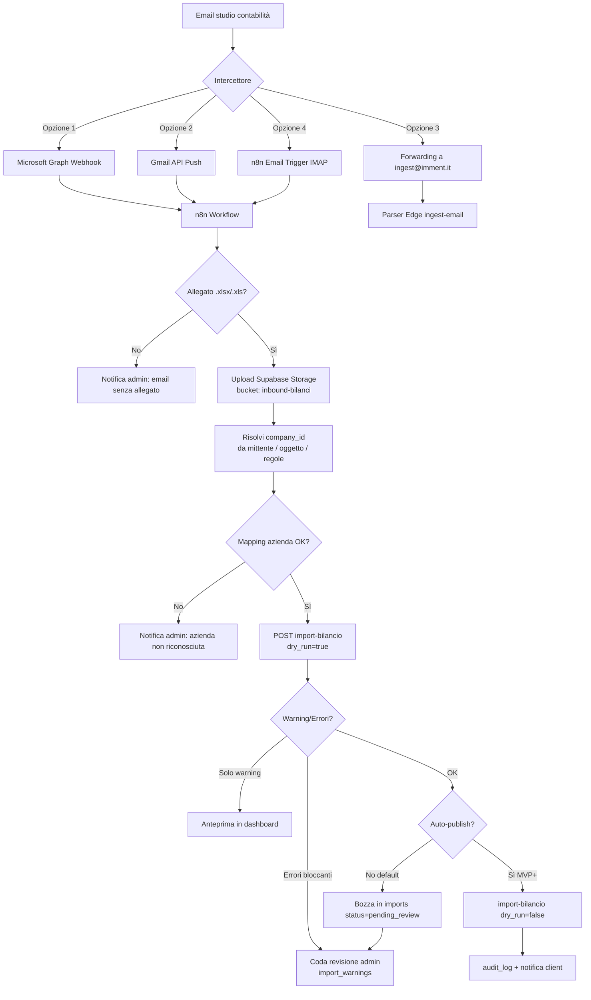
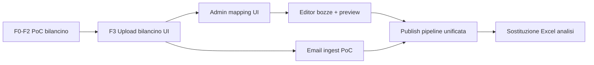

# Piano prodotto/architettura — Da dashboard bilanci a gestionale modulare

> **Stato:** design actionable · **Data:** 2026-06-09  
> **Scope:** evoluzione di `bilanci_dashboard` verso gestionale custom modulare Imment  
> **Non implementa codice** — guida decisioni e roadmap

---

## Executive summary

Il progetto ha già le fondamenta giuste: **ETL condiviso** (`shared/etl/`), **modello dati normalizzato** (`financial_facts`, `report_layout`, `imports`), **PoC bilancino** (`account_balances` + `ledger_account_mappings` + `pipelineBilancino` in memoria), **RLS multi-tenant** e **pattern preview→commit** nell'Edge Function `import-bilancio`.

La evoluzione verso gestionale richiede tre pilastri:

1. **F3** — chiudere l'upload bilancino via UI (stesso contratto dry-run/commit dell'analisi CE).
2. **Editor** — editing a strati con bozze, audit e ricalcolo pipeline prima del commit.
3. **Email ingest** — orchestrazione esterna (n8n) + core ingest in Supabase (Edge Function già esistente).

**Raccomandazione architetturale:** monorepo attuale con `shared/*` come kernel; moduli come feature verticali nel client; n8n come **bus di integrazione email**, non come motore ETL.

---

## Stato attuale (baseline tecnica)

| Layer | Componenti | Note |
|-------|------------|------|
| **UI** | React + Vite, wouter, TanStack Query | Pagine CE flat nella sidebar |
| **Auth** | Supabase Auth + `bilanci_users` | Ruoli `admin` / `client` |
| **Dati CE analisi** | `financial_facts`, `report_layout`, `account_mappings` | Import via `import-bilancio` Edge Function |
| **Dati bilancino** | `account_balances`, `ledger_account_mappings` | Aggregazione **solo in memoria** (`pipelineBilancino`) — non ancora in `financial_facts` |
| **ETL** | `shared/etl/pipeline.ts`, `pipelineBilancino.ts` | Golden tests, profili template |
| **Sicurezza** | RLS deny-by-default | Admin CRUD, client read-only per `company_id` |
| **Import UI** | `import-data.tsx` | Wizard upload → preview → conferma (solo analisi CE oggi) |

### Due pipeline parallele (da unificare nel tempo)

```
Excel Analisi CE  →  detect/extract/map  →  financial_facts + report_layout
Excel Bilancino   →  extractBilancino     →  account_balances
                      ↓ (in memoria)
                   pipelineBilancino      →  confronto vs CE (PoC F0-F2)
```

**Decisione prodotto pendente:** quando il bilancino è validato su tutte le aziende, diventa **source of truth** mensile e sostituisce (o affianca) l'Excel analisi.

---

## A. Editor dati finanziari (gestionale)

### A.1 Cosa si può editare — gerarchia e implicazioni

| Entità | Editabile? | Chi | Effetto downstream | Priorità MVP |
|--------|------------|-----|-------------------|--------------|
| **`account_balances`** | ✅ Sì (core bilancino) | Admin | Ricalcolo aggregati CE via `pipelineBilancino` | **Alta** |
| **`ledger_account_mappings`** | ✅ Sì | Admin | Cambia come i conti confluiscono nelle voci analitiche | **Alta** |
| **`account_mappings`** (label CE analisi) | ✅ Sì | Admin | Impatta re-import e mapping label→canonico | **Media** |
| **`financial_facts`** | ⚠️ Solo override mirati | Admin | Scorciatoia per correzioni post-aggregazione; rischio disallineamento | **Bassa** (fase 2) |
| **`report_layout`** | ⚠️ Struttura + label, non valori calcolati | Admin | Fedeltà visiva Excel; non è source of truth numerica | **Media** |
| **`master_chart_of_accounts`** | ❌ Read-only client; edit globale admin | Super-admin | Impatta tutte le aziende | **Bassa** |

**Principio guida:** editare il più **a monte** possibile nella catena dati.

```
account_balances  →  pipelineBilancino  →  financial_facts (derivati)
ledger_account_mappings ─────────────────┘
report_layout  →  solo presentazione (layout Excel)
```

- **Correzione valore su una voce CE mostrata:** idealmente si risale al conto bilancino o al mapping, non si patcha il fatto aggregato.
- **Override su `financial_facts`:** ammesso solo con flag `source = 'manual_override'` e obbligo di motivazione; usato per rettifiche che non hanno equivalente contabile.

### A.2 UX editor

#### Vista principale: griglia editabile multi-livello

| Vista | Contenuto | Componente UI suggerito |
|-------|-----------|-------------------------|
| **Bilancino** | Conto × mese, saldo raw/normalizzato | Data grid (TanStack Table + celle editabili) |
| **Mapping ledger** | Conto → analitica, sign_multiplier | Tabella con autocomplete su master chart |
| **CE riclassificato** | Voci canoniche con drill-down ai conti | Tree grid + pannello dettaglio |
| **Confronto** | Excel import vs calcolato vs bozza edit | Split view con diff evidenziato |

#### Flusso utente (preview → commit)

```
1. Admin apre periodo (company, year, month)
2. Carica stato "published" da DB
3. Modifiche → stato locale "draft" (non persistite su tabelle live)
4. Click "Ricalcola" → run pipeline in memoria (shared/etl)
5. Preview: KPI, quadrature, warning, diff vs published
6. Click "Salva bozza" → draft_imports
7. Click "Pubblica" → transazione atomica + audit_log
   oppure "Invia in approvazione" → workflow review
```

Riutilizzare il pattern già collaudato in `import-data.tsx` (dry_run) e `import-bilancio` Edge Function.

#### Permessi

| Azione | Admin Imment | Client azienda |
|--------|--------------|----------------|
| Visualizza dati pubblicati | ✅ tutte le aziende | ✅ solo propria `company_id` |
| Crea/modifica bozza | ✅ | ❌ (fase 1) — opzionale read-only commenti in v2 |
| Pubblica senza approvazione | ✅ | ❌ |
| Modifica mapping | ✅ | ❌ |
| Esporta Excel | ✅ | ✅ (solo published) |

**Estensione RLS necessaria:** policy `INSERT/UPDATE` su `account_balances` e `ledger_account_mappings` per admin (oggi già admin_all); aggiungere policy su nuove tabelle draft/audit.

### A.3 Schema DB proposto

#### Tabelle nuove (additive)

```sql
-- Bozza di editing: snapshot JSON del delta + metadata
draft_edits (
  id, company_id, period_year, period_month,
  base_import_id,           -- import di riferimento
  status,                   -- 'editing' | 'pending_review' | 'approved' | 'rejected' | 'published'
  created_by, created_at, updated_at,
  preview_snapshot jsonb,   -- output pipeline post-edit (KPI, facts calcolati)
  diff_summary jsonb        -- conteggi modifiche per UI
)

-- Dettaglio atomico delle modifiche (per audit e rollback)
draft_edit_changes (
  id, draft_edit_id,
  entity_type,              -- 'account_balance' | 'ledger_mapping' | 'report_layout_row'
  entity_key jsonb,         -- es. {account_code, year, month}
  field_name,
  old_value, new_value,
  changed_at, changed_by
)

-- Audit trail append-only (tutte le azioni sensibili)
audit_log (
  id, company_id, actor_id, action,       -- 'import' | 'edit_publish' | 'mapping_change' | 'email_ingest'
  entity_type, entity_id,
  payload jsonb,
  created_at
)

-- Versioni pubblicate (opzionale ma consigliato per rollback)
published_snapshots (
  id, company_id, period_year, period_month,
  version, published_by, published_at,
  import_id, draft_edit_id,
  facts_hash                -- per idempotenza
)
```

**`financial_facts_edits`:** non serve come tabella separata se si adotta il modello **draft → publish** che rigenera `financial_facts` dalla pipeline. Gli override manuali su facts possono vivere in `draft_edit_changes` con `entity_type = 'financial_fact_override'`.

**`draft_imports`:** rinominare concettualmente in `draft_edits` — più generico (non solo import file).

#### Migrazione concettuale bilancino → facts

Quando il PoC è validato:

1. `pipelineBilancino` produce `LoadPlan` compatibile con `financial_facts`.
2. Publish atomico: `account_balances` + facts derivati + invalidazione cache UI.
3. `report_layout` rigenerato o aggiornato se si mantiene fedeltà Excel.

### A.4 Ricalcolo post-edit

```
┌─────────────────┐     ┌──────────────────────┐     ┌─────────────────┐
│ draft changes   │────▶│ merge con published  │────▶│ runBilancino    │
│ (in memoria)    │     │ account_balances     │     │ Pipeline        │
└─────────────────┘     └──────────────────────┘     └────────┬────────┘
                                                              │
                    ┌─────────────────────────────────────────┘
                    ▼
         ┌──────────────────────┐     ┌──────────────────────┐
         │ buildLoadPlan        │────▶│ validate + quadrature│
         │ (facts + layout)     │     │ (shared/etl/validate)│
         └──────────────────────┘     └──────────┬───────────┘
                                                   │
                              preview JSON ◀───────┘
                              commit transazione ──▶ DB
```

- **Preview:** Edge Function `recalculate-preview` (o estensione `import-bilancio`) che accetta JSON draft + `company_id` + periodo; usa `service_role`; non scrive su tabelle live.
- **Commit:** RPC Postgres `publish_draft_edit(draft_id)` con transazione: applica changes → rigenera facts → aggiorna `imports.status` → scrive `audit_log` → marca draft `published`.

### A.5 Rischio sovrascrittura vs Excel studio — workflow approvazione

| Scenario | Rischio | Mitigazione |
|----------|---------|-------------|
| Nuovo Excel arriva mentre c'è draft aperto | Sovrascrittura silenziosa | Lock ottimistico su `(company_id, year, month)`; warning se draft pendente |
| Edit manuale poi Excel ufficiale | Due verità | Flag `data_source_priority`: `excel_import` > `manual` o viceversa per periodo |
| Client vede numeri diversi da Excel inviato | Fiducia | Export Excel "as published" + watermark versione |
| Mapping errato | Errori sistemici | Coda `import_warnings` + blocco publish se error severity |

**Workflow approvazione consigliato (fase Editor v1):**

```
Admin edita → Salva bozza → [opzionale] Review secondo admin
                         → Pubblica → Notifica client "dati aggiornati"
```

Per Imment/startup: **approvazione a 1 admin** in MVP; doppia approvazione solo se richiesto dal cliente.

---

## B. Workflow email → ingest automatico

### B.1 Confronto n8n vs API nativa (Supabase Edge + webhook)

| Criterio | **n8n** (cloud/self-hosted) | **API/Edge nativa** (Supabase) |
|----------|-------------------------------|--------------------------------|
| **Setup** | Veloce: nodi Gmail/Outlook, storage, HTTP; UI visuale | Medio: Edge Function webhook + integrazione Graph/Gmail API + Storage |
| **Manutenzione** | Workflow visibili, modificabili da non-dev; rischio drift versioni | Codice in repo, testabile, review PR; meno accessibile a non-dev |
| **Costi** | n8n Cloud ~20€+/mese; self-hosted = infra + tempo ops | Incluso in Supabase (Edge invocations + Storage); costo dev iniziale |
| **Flessibilità formati email/allegati** | Alta: branching, filtri, trasformazioni, retry, alerting multi-canale | Alta ma tutto in codice; ogni variante = deploy |
| **Sicurezza** | Credenziali email in n8n vault; altro sistema da harden | Credenziali in Supabase secrets; meno superficie se orchestrazione minimale |
| **Osservabilità** | Execution log n8n | Supabase logs + `imports` + `audit_log` |
| **Testabilità** | Difficile in CI | Golden tests su Edge Function |
| **Vendor lock-in** | Medio (n8n) | Basso (codice proprio) |

### B.2 Raccomandazione per contesto Imment/startup

**Approccio ibrido:**

| Responsabilità | Dove |
|----------------|------|
| Ricezione email, parsing envelope, estrazione allegati, routing per mittente/oggetto | **n8n** |
| Storage file, dedup hash, detect template, ETL, load DB, warning | **Supabase** (Edge `import-bilancio` + Storage bucket) |
| Notifiche errore (Slack/email admin) | **n8n** (o Supabase + Resend in fase 2) |

**Perché non solo Edge nativa:** Imment ha già n8n nel toolchain; l'integrazione email (Graph OAuth, refresh token, allegati multipli, regole per studio) è **integration glue** — domínio di n8n. L'ETL è **dominio applicativo** — già in `shared/etl`.

**Perché non solo n8n:** Duplicare la pipeline ETL in nodi n8n crea due fonti di verità, difficili da testare. n8n deve chiamare `POST /functions/v1/import-bilancio` con `dry_run=true` prima del commit.

### B.3 Workflow consigliato



### B.4 Opzioni intercettore email

| Opzione | Pro | Contro | Quando sceglierla |
|---------|-----|--------|-------------------|
| **Microsoft Graph** (Outlook/M365) | Nativo se studio usa M365; webhook real-time | OAuth app registration, permessi tenant | **Consigliato** se studio Imment/clienti su Outlook |
| **Gmail API** | Push notifications, API mature | Setup Google Cloud, meno comune in studi IT | Se provider Gmail/Google Workspace |
| **Forwarding + indirizzo dedicato** | Semplicissimo (`bilanci+awentia@imment.it`) | Parsing limitato, spam, meno metadata | **MVP rapido** / PoC |
| **n8n Email Trigger (IMAP)** | Zero codice per polling | Polling latency, credenziali IMAP fragili | Backup o ambienti senza API |

### B.5 Estensioni DB per email ingest

```sql
-- Regole routing email → company
email_ingest_rules (
  id, company_id,
  match_type,               -- 'sender_domain' | 'subject_regex' | 'plus_address'
  match_value,
  file_type,                -- 'analisi_ce' | 'bilancino'
  auto_publish boolean default false,
  created_at
)

-- Tracciamento file in arrivo
inbound_files (
  id, company_id,
  storage_path, file_hash,
  source,                   -- 'email' | 'ui_upload' | 'api'
  email_message_id,
  import_id,
  status,                   -- 'received' | 'processing' | 'completed' | 'failed'
  received_at
)
```

---

## C. Architettura modulare prodotto

### C.1 Moduli funzionali

| Modulo | ID | Stato | Descrizione |
|--------|-----|-------|-------------|
| **Riclassificati CE** | `ce` | ✅ MVP | Dashboard, CE dettaglio/sintetico, mensile |
| **Import/Workflow** | `import` | 🔄 F3 | Upload UI, email ingest, coda warning |
| **Admin/Mapping** | `admin` | 📋 Pianificato | Mapping conti, profili template, regole email |
| **Editor** | `editor` | 📋 Pianificato | Griglia edit, bozze, publish |
| **Partitari** | `ledger` | 🔮 Futuro | Vista partitari mensili, drill-down conti |
| **Dashboard KPI** | `kpi` | ✅ Parziale | KPI cards; estendibile con moduli custom |

### C.2 Struttura monorepo proposta

```
bilanci_dashboard/
├── client/
│   ├── src/
│   │   ├── modules/              # NEW: feature verticali
│   │   │   ├── ce/
│   │   │   ├── import/
│   │   │   ├── editor/
│   │   │   ├── admin/
│   │   │   └── ledger/
│   │   ├── core/                 # shell: auth, layout, routing
│   │   └── shared-ui/            # componenti cross-modulo
├── shared/
│   ├── domain/                   # già presente: formule, periodi
│   ├── etl/                      # già presente: pipeline
│   ├── queries/                  # già presente: financialModel
│   └── modules/                  # NEW: registry, feature flags, permessi
│       ├── registry.ts
│       └── flags.ts
├── supabase/
│   ├── functions/
│   │   ├── import-bilancio/
│   │   ├── import-bilancino/     # NEW F3
│   │   ├── recalculate-preview/  # NEW Editor
│   │   └── ingest-email/         # NEW opzionale (se non solo n8n)
│   └── migrations/
└── docs/
```

### C.3 Feature flags e routing

```typescript
// shared/modules/flags.ts (concettuale)
export const MODULE_FLAGS = {
  ce: { enabled: true, minRole: 'client' },
  import: { enabled: true, minRole: 'admin' },
  editor: { enabled: false, minRole: 'admin' },      // abilitare per company
  ledger: { enabled: false, minRole: 'client' },
  emailIngest: { enabled: false, minRole: 'admin' },
};
```

- **Per company:** tabella `company_modules (company_id, module_id, enabled)` per rollout graduale.
- **Sidebar:** generata da `registry.ts` filtrando flags + ruolo utente.
- **Routing:** `/modules/:moduleId/...` o prefissi flat (`/ce/...`, `/import/...`) — preferire prefissi per semplicità MVP.

### C.4 Multi-tenant — estensioni RLS

Già presente: isolamento per `company_id` via `bilanci_users`.

| Estensione | Motivo |
|------------|--------|
| `company_modules` | Abilitare moduli per tenant |
| Policy su `draft_edits` | Admin all; client read published only |
| `audit_log` | Admin read; client read propria company (senza payload sensibili) |
| Storage bucket `inbound-bilanci` | RLS path `/{company_id}/*` |
| Ruolo `reviewer` (opzionale v2) | Tra admin e client per approvazioni |

### C.5 Roadmap fasi

| Fase | Scope | Effort | Output |
|------|-------|--------|--------|
| **MVP (oggi→+6 sett)** | F3 bilancino UI, import CE stabile, dashboard CE | **M** | Upload manuale end-to-end bilancino + confronto |
| **v1 (+6→12 sett)** | Editor bozze, mapping admin, email ingest PoC | **L** | Gestionale editabile con audit; email→import automatico |
| **v2 (+12→20 sett)** | Publish bilancino→facts, partitari, approvazioni, export | **L-XL** | Sostituzione Excel analisi per clienti pilota |
| **v3 (2026 H2)** | Moduli aggiuntivi, API partner, white-label | **XL** | Piattaforma modulare multi-prodotto |

Effort: S < 1 sett, M 1-2 sett, L 3-4 sett, XL > 1 mese (team 1-2 dev).

---

## D. Dipendenze e ordine implementazione



### Ordine consigliato

| # | Iniziativa | Dipende da | Perché prima |
|---|------------|------------|--------------|
| 1 | **F3 — Upload bilancino UI** | PoC F0-F2 | Stesso pattern import-data; sblocca dati reali in DB |
| 2 | **Admin mapping UI** | F3 | Senza mapping editabile, l'editor ha poco valore |
| 3 | **Schema draft_edits + audit_log** | F3 | Fondazione editor senza toccare tabelle live |
| 4 | **Editor MVP** (bilancino + mapping) | #2, #3 | Valore gestionale immediato |
| 5 | **Email ingest PoC** (forwarding + n8n) | F3 o import CE | Può procedere in parallelo dopo #1 stabile |
| 6 | **Publish bilancino → financial_facts** | Editor + validazione PoC | Unificazione pipeline |
| 7 | **Workflow approvazione** | Editor | Rischio compliance |
| 8 | **Modulo Partitari** | #6 | Dati granulari già in `account_balances` |

**F3 e Email in parallelo:** possibile solo se F3 definisce il contratto API (`import-bilancino`) che anche n8n chiamerà. L'Editor **non** deve precedere F3.

---

## E. Decisioni da chiedere all'utente

### E.1 Provider email

- [ ] Quale client email usa lo studio / i clienti? (**Outlook M365** / Gmail / altro)
- [ ] Chi possiede il tenant Microsoft per app registration Graph?
- [ ] Indirizzo dedicato per forwarding accettabile come MVP? (es. `ingest@imment.it`)

### E.2 Governance edit

- [ ] Chi approva edit manuali prima della pubblicazione? (admin Imment solo / admin + referente cliente)
- [ ] I client possono mai proporre modifiche (commento/richiesta) o solo visualizzare?
- [ ] Serve storico versioni consultabile dal client?

### E.3 Strategia dati bilancino vs Excel analisi

- [ ] Il bilancino mensile **sostituisce** l'Excel analisi quando validato su tutte le aziende?
- [ ] Se sì, quali aziende sono pilota e quali criteri di validazione? (quadrature, KPI entro ±X%)
- [ ] Durante la transizione: mostrare **entrambe** le fonti o solo quella prioritaria?

### E.4 Operatività

- [ ] Email ingest: auto-publish o sempre coda review admin?
- [ ] n8n: cloud Imment o self-hosted?
- [ ] Notifiche errore: email, Slack, entrambi?

---

## Prossimi 3 sprint suggeriti

### Sprint 1 — "F3 chiuso" (2 settimane)

**Obiettivo:** upload bilancino end-to-end dalla UI, parità con import CE.

| Task | Deliverable |
|------|-------------|
| Edge Function `import-bilancino` | dry_run + commit, load `account_balances` + `ledger_account_mappings` |
| Estendere `import-data.tsx` | Tab/toggle Analisi CE vs Bilancino |
| Test golden | `pipelineBilancino` + load su fixture Awentia |
| Vista confronto | Pagina o sezione: bilancino aggregato vs `financial_facts` |

**Definition of done:** admin carica bilancino mensile, vede preview/warning, conferma, dati in DB, confronto CE visibile.

---

### Sprint 2 — "Fondamenta gestionale" (2 settimane)

**Obiettivo:** schema bozze + mapping admin + preview ricalcolo.

| Task | Deliverable |
|------|-------------|
| Migration `draft_edits`, `audit_log`, `draft_edit_changes` | Schema + RLS |
| Pagina Admin Mapping | CRUD `ledger_account_mappings` per company |
| Edge `recalculate-preview` | Accetta draft JSON, ritorna KPI + diff |
| Regole lock periodo | Warning se import/email durante draft aperto |

**Definition of done:** admin modifica mapping, vede impatto in preview senza toccare dati published.

---

### Sprint 3 — "Editor MVP + Email PoC" (parziale)

**Obiettivo:** prima edit manuale pubblicabile + prima email automatica.

| Task | Stato |
|------|-------|
| Griglia edit `account_balances` | ✅ (Sprint 4–6) |
| RPC `publish_draft_edit` | ✅ |
| n8n workflow PoC | ✅ `n8n/workflows/bilanci-email-ingest-poc.json` + Edge `email-ingest` |
| `email_ingest_rules` seed | ✅ Awentia + Maia |
| Notifica admin su failure | 📋 in n8n (branch errore nel workflow) |

**Definition of done:** admin corregge un saldo, pubblica, dashboard aggiornata; email con allegato crea import in coda review.

---

## Metriche di successo

| Metrica | Target v1 |
|---------|-----------|
| Tempo import manuale → dashboard | < 2 min (vs ~15 min Excel) |
| % import email senza intervento manuale | > 70% (MVP+), > 90% (v1) |
| Warning mapping risolti prima publish | 100% error, > 80% warning |
| Edit manuali con audit trail | 100% |
| Discrepanza bilancino vs CE post-mapping | < 1% su KPI headline |

---

## Riferimenti codice esistente

| Area | Path |
|------|------|
| Schema normalizzato | `supabase/migrations/20260608120000_bilanci_normalized_schema.sql` |
| Schema bilancino | `supabase/migrations/20260609120000_ledger_bilancino_schema.sql` |
| RLS | `supabase/migrations/20260608120100_bilanci_rls_policies.sql` |
| Pipeline CE | `shared/etl/pipeline.ts` |
| Pipeline bilancino | `shared/etl/pipelineBilancino.ts` |
| Edge import | `supabase/functions/import-bilancio/index.ts` |
| UI import | `client/src/pages/import-data.tsx` |
| Modello query UI | `shared/queries/financialModel.ts` |
| Design ingest | `docs/analisi_ingest_eterogeneo.md` |

---

*Documento generato come base per decisioni prodotto. Aggiornare dopo le risposte alle decisioni in sezione E.*
